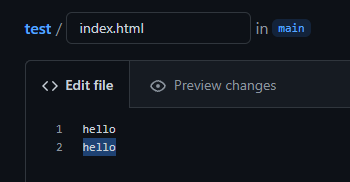

## Jenkins & Gitlab

Пулл образа jenkins

Заупск

Стрница доступа

Достаем секрет

Начальная страница

Поднят сервер nginx

Создаем проект и репозиторий
(Попутно добавляем ключи ssh для доступа к github)

Создаем репозиторий

Конфигурируем проект jenkins

Страница nginx показывает файл из githab

Вносим изменения в файл на github

Проверяем изменения на jenkins

