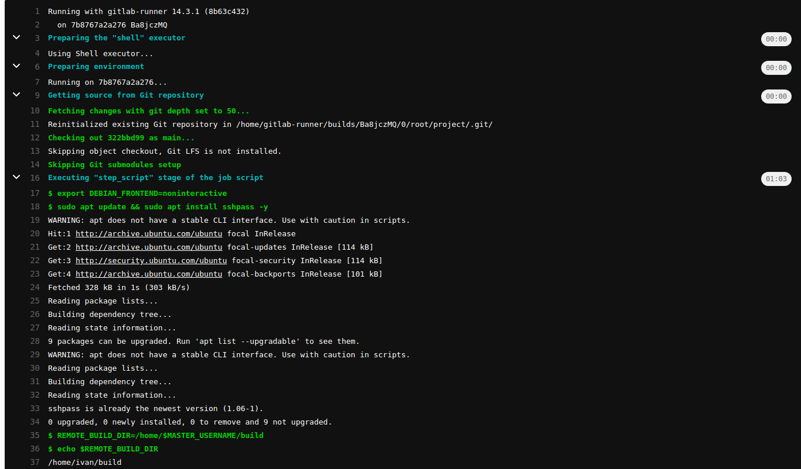
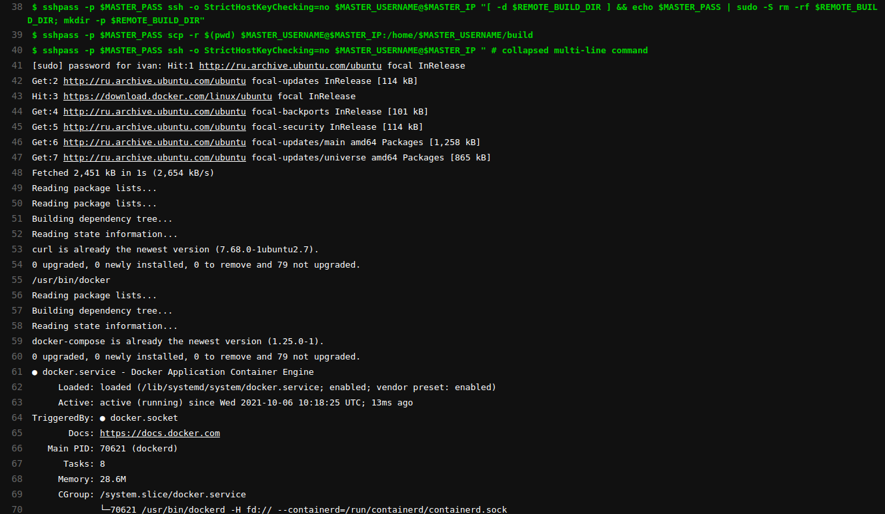
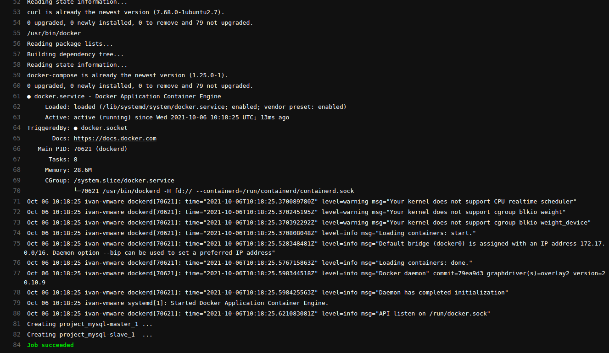

### gitlab
Установка gitlub

Находим пароль от root'а

Регистрация

Пишем .gitlab-ci.yml

Успешно вносим изменения

### lab 3

Создаем CI скрипт
[.gitlab-ci.yml](.gitlab-ci.yml)

Модифицируем docker-compose для mysql
[docker-compose-mysql.yml](docker-compose-mysql.yml)

Лог операции и успешное окончание

