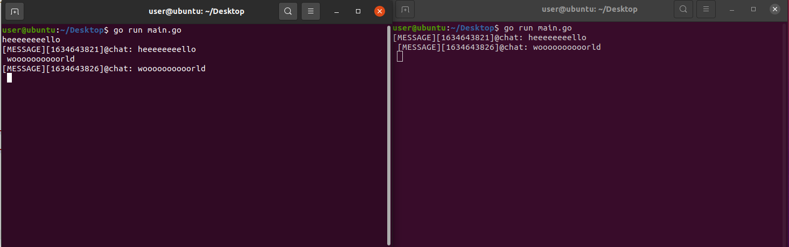

## Redis
Создаем проект и прописываем скрипт CI/CD 
Добавляем переменные
```
stages:
  - build

build-job:
  stage: build
  script: 
    - export DEBIAN_FRONTEND=noninteractive
    - sudo apt update && sudo apt install sshpass -y
    - REMOTE_BUILD_DIR=/home/$MASTER_USERNAME/build
    - echo $REMOTE_BUILD_DIR
    - sshpass -p $MASTER_PASS ssh -o StrictHostKeyChecking=no $MASTER_USERNAME@$MASTER_IP "[ -d $REMOTE_BUILD_DIR ] && echo $MASTER_PASS | sudo -S rm -rf $REMOTE_BUILD_DIR; mkdir -p $REMOTE_BUILD_DIR"
    - sshpass -p $MASTER_PASS scp -r $(pwd) $MASTER_USERNAME@$MASTER_IP:/home/$MASTER_USERNAME/build
    - >
      sshpass -p $MASTER_PASS ssh -o StrictHostKeyChecking=no $MASTER_USERNAME@$MASTER_IP "
        cd /home/$MASTER_USERNAME/build/redis
        echo $MASTER_PASS > password
        sudo -S apt-get update < password
        sudo -S apt-get install curl -y < password
        command -v docker;
        if [ $? -ne 0 ]; then
          curl -fsSL https://get.docker.com -o get-docker.sh
          sudo -S sh get-docker.sh < password
          rm get-docker.sh
        fi
        sudo -S apt-get install docker-compose -y < password
        sudo -S usermod -aG docker $MASTER_USERNAME < password
        rm password
        sudo -S service docker restart < password
        service docker status
        docker-compose up -d
      "
```


Запускаем [docker-compose.yml](docker-compose.yml)
Лог работы:
```
Running with gitlab-runner 14.3.2 (e0218c92)
  on 25d43e69e113 uYDayBSE
Preparing the "shell" executor 00:00
Using Shell executor...
Preparing environment 00:00
Running on 25d43e69e113...
Getting source from Git repository 00:00
Fetching changes with git depth set to 50...
Reinitialized existing Git repository in /home/gitlab-runner/builds/uYDayBSE/0/root/lab4/.git/
Checking out 531461ec as main...
Skipping object checkout, Git LFS is not installed.
Skipping Git submodules setup
Executing "step_script" stage of the job script
$ export DEBIAN_FRONTEND=noninteractive
$ sudo apt update && sudo apt install sshpass -y
WARNING: apt does not have a stable CLI interface. Use with caution in scripts.
Hit:1 http://archive.ubuntu.com/ubuntu focal InRelease
Hit:2 http://archive.ubuntu.com/ubuntu focal-updates InRelease
Hit:3 http://security.ubuntu.com/ubuntu focal-security InRelease
Hit:4 http://archive.ubuntu.com/ubuntu focal-backports InRelease
Reading package lists...
Reading package lists...
Building dependency tree...
Reading state information...
10 packages can be upgraded. Run 'apt list --upgradable' to see them.
WARNING: apt does not have a stable CLI interface. Use with caution in scripts.
Reading package lists...
Building dependency tree...
Reading state information...
sshpass is already the newest version (1.06-1).
0 upgraded, 0 newly installed, 0 to remove and 10 not upgraded.
$ REMOTE_BUILD_DIR=/home/$MASTER_USERNAME/build
$ echo $REMOTE_BUILD_DIR
/home/user/build
$ sshpass -p $MASTER_PASS ssh -o StrictHostKeyChecking=no $MASTER_USERNAME@$MASTER_IP "[ -d $REMOTE_BUILD_DIR ] && echo $MASTER_PASS | sudo -S rm -rf $REMOTE_BUILD_DIR; mkdir -p $REMOTE_BUILD_DIR"
[sudo] password for user: $ sshpass -p $MASTER_PASS scp -r $(pwd) $MASTER_USERNAME@$MASTER_IP:/home/$MASTER_USERNAME/build
$ sshpass -p $MASTER_PASS ssh -o StrictHostKeyChecking=no $MASTER_USERNAME@$MASTER_IP " # collapsed multi-line command
[sudo] password for user: Hit:1 http://ru.archive.ubuntu.com/ubuntu focal InRelease
Hit:2 http://ru.archive.ubuntu.com/ubuntu focal-updates InRelease
Hit:3 http://ru.archive.ubuntu.com/ubuntu focal-backports InRelease
Hit:4 http://ru.archive.ubuntu.com/ubuntu focal-security InRelease
Reading package lists...
Reading package lists...
Building dependency tree...
Reading state information...
curl is already the newest version (7.68.0-1ubuntu2.7).
0 upgraded, 0 newly installed, 0 to remove and 3 not upgraded.
/usr/bin/docker
Reading package lists...
Building dependency tree...
Reading state information...
docker-compose is already the newest version (1.25.0-1).
0 upgraded, 0 newly installed, 0 to remove and 3 not upgraded.
bash: line 14: password: No such file or directory
● docker.service - Docker Application Container Engine
     Loaded: loaded (/lib/systemd/system/docker.service; enabled; vendor preset: enabled)
     Active: active (running) since Tue 2021-10-19 11:16:58 UTC; 4min 48s ago
TriggeredBy: ● docker.socket
       Docs: https://docs.docker.com
   Main PID: 6438 (dockerd)
      Tasks: 8
     Memory: 41.2M
     CGroup: /system.slice/docker.service
             └─6438 /usr/bin/dockerd -H fd:// --containerd=/run/containerd/containerd.sock
Oct 19 11:16:57 user dockerd[6438]: time="2021-10-19T11:16:57.210363474Z" level=warning msg="Your kernel does not support CPU realtime scheduler"
Oct 19 11:16:57 user dockerd[6438]: time="2021-10-19T11:16:57.210526073Z" level=warning msg="Your kernel does not support cgroup blkio weight"
Oct 19 11:16:57 user dockerd[6438]: time="2021-10-19T11:16:57.210738459Z" level=warning msg="Your kernel does not support cgroup blkio weight_device"
Oct 19 11:16:57 user dockerd[6438]: time="2021-10-19T11:16:57.211056484Z" level=info msg="Loading containers: start."
Oct 19 11:16:57 user dockerd[6438]: time="2021-10-19T11:16:57.605883827Z" level=info msg="Default bridge (docker0) is assigned with an IP address 172.17.0.0/16. Daemon option --bip can be used to set a preferred IP address"
Oct 19 11:16:58 user dockerd[6438]: time="2021-10-19T11:16:58.195899956Z" level=info msg="Loading containers: done."
Oct 19 11:16:58 user dockerd[6438]: time="2021-10-19T11:16:58.307320625Z" level=info msg="Docker daemon" commit="20.10.7-0ubuntu1~20.04.2" graphdriver(s)=overlay2 version=20.10.7
Oct 19 11:16:58 user dockerd[6438]: time="2021-10-19T11:16:58.307789045Z" level=info msg="Daemon has completed initialization"
Oct 19 11:16:58 user systemd[1]: Started Docker Application Container Engine.
Oct 19 11:16:58 user dockerd[6438]: time="2021-10-19T11:16:58.532625009Z" level=info msg="API listen on /run/docker.sock"
/home/user/build/lab4
Creating network "lab4_redis-replication" with driver "bridge"
Pulling redis (redis:)...
latest: Pulling from library/redis
Digest: sha256:a89cb097693dd354de598d279c304a1c73ee550fbfff6d9ee515568e0c749cfe
Status: Downloaded newer image for redis:latest
Creating master ... 
Creating slave  ... 
Job succeeded
```

Проверка работы чатом на golang [main,go](main.go)

