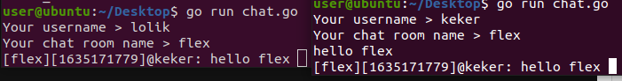
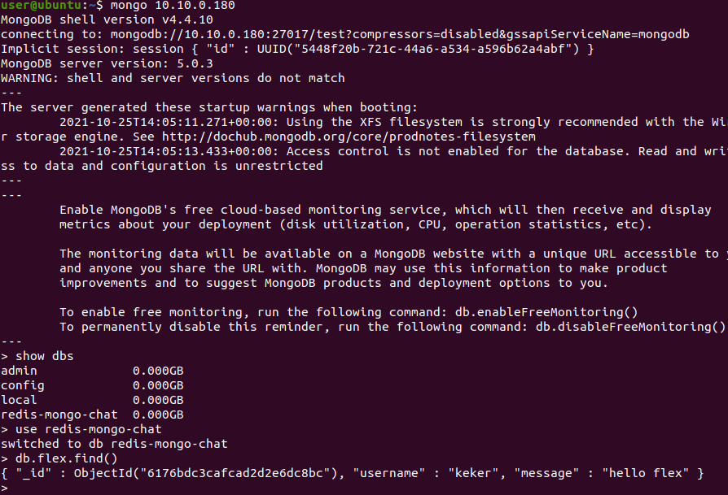

### mongo + chat + gitlab

Создаем новый проект и прописываем файл [.gitlab-ci.yml](.gitlab-ci.yml)
```
stages:
  - build

build-job:
  stage: build
  script:
    - export DEBIAN_FRONTEND=noninteractive
    - sudo apt update && sudo apt install sshpass -y
    - REMOTE_BUILD_DIR=/home/$MASTER_USERNAME/build
    - echo $REMOTE_BUILD_DIR
    - sshpass -p $MASTER_PASS ssh -o StrictHostKeyChecking=no $MASTER_USERNAME@$MASTER_IP "[ -d $REMOTE_BUILD_DIR ] && echo $MASTER_PASS | sudo -S rm -rf $REMOTE_BUILD_DIR; mkdir -p $REMOTE_BUILD_DIR"
    - sshpass -p $MASTER_PASS scp -r $(pwd) $MASTER_USERNAME@$MASTER_IP:/home/$MASTER_USERNAME/build
    - >
      sshpass -p $MASTER_PASS ssh -o StrictHostKeyChecking=no $MASTER_USERNAME@$MASTER_IP "
        cd /home/$MASTER_USERNAME/build/redis
        echo $MASTER_PASS > password
        sudo -S apt-get update < password
        sudo -S apt-get install curl -y < password
        command -v docker;
        if [ $? -ne 0 ]; then
          curl -fsSL https://get.docker.com -o get-docker.sh
          sudo -S sh get-docker.sh < password
          rm get-docker.sh
        fi
        sudo -S apt-get install docker-compose -y < password
        sudo -S usermod -aG docker $MASTER_USERNAME < password
        rm password
        sudo -S service docker restart < password
        service docker status
        docker-compose down
        docker rm -f $(docker ps -a -q)
        docker-compose up -d
      "
```
Прописываем [docker-compose.yml](docker-compose.yml)
```
version: '3.3'

services:
  redis:
    image: redis
    container_name: master
    ports:
      - "33333:6379"

  redis-slave:
    image: redis
    container_name: slave
    ports:
      - "33334:6379"
    command: redis-server --slaveof master 6379
    depends_on:
      - redis

  mongo:
    image: mongo
    container_name: mongo
    ports:
      - "27017:27017"
```
Лог запуска проекта gitlab
```
Running with gitlab-runner 14.3.2 (e0218c92)
  on 25d43e69e113 ouMkJ7jy
Preparing the "shell" executor 00:00
Using Shell executor...
Preparing environment 00:00
Running on 25d43e69e113...
Getting source from Git repository
Fetching changes with git depth set to 50...
Reinitialized existing Git repository in /home/gitlab-runner/builds/ouMkJ7jy/0/root/lab5/.git/
Checking out 067b3b2e as main...
Skipping object checkout, Git LFS is not installed.
Skipping Git submodules setup
Executing "step_script" stage of the job script 00:51
$ export DEBIAN_FRONTEND=noninteractive
$ sudo apt update && sudo apt install sshpass -y
WARNING: apt does not have a stable CLI interface. Use with caution in scripts.
Hit:1 http://archive.ubuntu.com/ubuntu focal InRelease
Hit:2 http://security.ubuntu.com/ubuntu focal-security InRelease
Hit:3 http://archive.ubuntu.com/ubuntu focal-updates InRelease
Hit:4 http://archive.ubuntu.com/ubuntu focal-backports InRelease
Reading package lists...
Building dependency tree...
Reading state information...
10 packages can be upgraded. Run 'apt list --upgradable' to see them.
WARNING: apt does not have a stable CLI interface. Use with caution in scripts.
Reading package lists...
Building dependency tree...
Reading state information...
sshpass is already the newest version (1.06-1).
0 upgraded, 0 newly installed, 0 to remove and 10 not upgraded.
$ REMOTE_BUILD_DIR=/home/$MASTER_USERNAME/build
$ echo $REMOTE_BUILD_DIR
/home/user/build
$ sshpass -p $MASTER_PASS ssh -o StrictHostKeyChecking=no $MASTER_USERNAME@$MASTER_IP "[ -d $REMOTE_BUILD_DIR ] && echo $MASTER_PASS | sudo -S rm -rf $REMOTE_BUILD_DIR; mkdir -p $REMOTE_BUILD_DIR"
[sudo] password for user: $ sshpass -p $MASTER_PASS scp -r $(pwd) $MASTER_USERNAME@$MASTER_IP:/home/$MASTER_USERNAME/build
$ sshpass -p $MASTER_PASS ssh -o StrictHostKeyChecking=no $MASTER_USERNAME@$MASTER_IP " # collapsed multi-line command
bash: line 126: docker: command not found
[sudo] password for user: Hit:1 http://ru.archive.ubuntu.com/ubuntu focal InRelease
Hit:2 http://ru.archive.ubuntu.com/ubuntu focal-updates InRelease
Hit:3 http://ru.archive.ubuntu.com/ubuntu focal-backports InRelease
Hit:4 http://ru.archive.ubuntu.com/ubuntu focal-security InRelease
Reading package lists...
Reading package lists...
Building dependency tree...
Reading state information...
curl is already the newest version (7.68.0-1ubuntu2.7).
0 upgraded, 0 newly installed, 0 to remove and 4 not upgraded.
/usr/bin/docker
Reading package lists...
Building dependency tree...
Reading state information...
docker-compose is already the newest version (1.25.0-1).
0 upgraded, 0 newly installed, 0 to remove and 4 not upgraded.
bash: line 14: password: No such file or directory
● docker.service - Docker Application Container Engine
     Loaded: loaded (/lib/systemd/system/docker.service; enabled; vendor preset: enabled)
     Active: active (running) since Mon 2021-10-25 13:31:47 UTC; 33min ago
TriggeredBy: ● docker.socket
       Docs: https://docs.docker.com
   Main PID: 1210 (dockerd)
      Tasks: 11
     Memory: 143.3M
     CGroup: /system.slice/docker.service
             └─1210 /usr/bin/dockerd -H fd:// --containerd=/run/containerd/containerd.sock
Oct 25 14:00:54 user dockerd[1210]: time="2021-10-25T14:00:54.149900610Z" level=info msg="ignoring event" container=da1a4e2b4b74d743f8c00356a6cf69c7657ac63e7c6722f010e3294e8da75eb3 module=libcontainerd namespace=moby topic=/tasks/delete type="*events.TaskDelete"
Oct 25 14:01:43 user dockerd[1210]: time="2021-10-25T14:01:43.048609311Z" level=info msg="No non-localhost DNS nameservers are left in resolv.conf. Using default external servers: [nameserver 8.8.8.8 nameserver 8.8.4.4]"
Oct 25 14:01:43 user dockerd[1210]: time="2021-10-25T14:01:43.051152761Z" level=info msg="IPv6 enabled; Adding default IPv6 external servers: [nameserver 2001:4860:4860::8888 nameserver 2001:4860:4860::8844]"
Oct 25 14:01:43 user dockerd[1210]: time="2021-10-25T14:01:43.831464977Z" level=info msg="No non-localhost DNS nameservers are left in resolv.conf. Using default external servers: [nameserver 8.8.8.8 nameserver 8.8.4.4]"
Oct 25 14:01:43 user dockerd[1210]: time="2021-10-25T14:01:43.831787414Z" level=info msg="IPv6 enabled; Adding default IPv6 external servers: [nameserver 2001:4860:4860::8888 nameserver 2001:4860:4860::8844]"
Oct 25 14:02:26 user dockerd[1210]: time="2021-10-25T14:02:26.111623007Z" level=info msg="No non-localhost DNS nameservers are left in resolv.conf. Using default external servers: [nameserver 8.8.8.8 nameserver 8.8.4.4]"
Oct 25 14:02:26 user dockerd[1210]: time="2021-10-25T14:02:26.112050915Z" level=info msg="IPv6 enabled; Adding default IPv6 external servers: [nameserver 2001:4860:4860::8888 nameserver 2001:4860:4860::8844]"
Oct 25 14:03:33 user dockerd[1210]: time="2021-10-25T14:03:33.175492606Z" level=info msg="ignoring event" container=d06cd1a256b0278ca5ff510e972cbae24f4afd8d7640ed3999b051915fec1dce module=libcontainerd namespace=moby topic=/tasks/delete type="*events.TaskDelete"
Oct 25 14:03:33 user dockerd[1210]: time="2021-10-25T14:03:33.189948228Z" level=info msg="ignoring event" container=618b4563f22de5fd4a761521640cb49830b622575489590f858aa58bb7da7570 module=libcontainerd namespace=moby topic=/tasks/delete type="*events.TaskDelete"
Oct 25 14:03:33 user dockerd[1210]: time="2021-10-25T14:03:33.201933455Z" level=info msg="ignoring event" container=a58b1a9671fa17b7f6864b3f60225a138c3452f623ed8223822d1997110a770d module=libcontainerd namespace=moby topic=/tasks/delete type="*events.TaskDelete"
Removing network lab5_default
"docker rm" requires at least 1 argument.
See 'docker rm --help'.
Usage:  docker rm [OPTIONS] CONTAINER [CONTAINER...]
Remove one or more containers
Creating network "lab5_default" with the default driver
Creating mongo ... 
Creating master ... 
Creating slave  ... 
Job succeeded
```
Запускаем [chat.go](chat.go) при конфиг файле [.env](.env)
```
package main

import (
	"bufio"
	"context"
	"encoding/json"
	"fmt"
	"github.com/go-redis/redis/v8"
	"github.com/joho/godotenv"
	"go.mongodb.org/mongo-driver/bson"
	"go.mongodb.org/mongo-driver/mongo"
	"go.mongodb.org/mongo-driver/mongo/options"
	"log"
	"os"
	"strings"
	"time"
)

type chatInfo struct {
	Username string
	Message  string
}

func main() {
	err := godotenv.Load()
	if err != nil {
		log.Fatal("Error loading .env file")
	}

	reader := bufio.NewReader(os.Stdin)
	fmt.Printf("Your username > ")
	username, _ := reader.ReadString('\n')
	username = strings.TrimSuffix(username, "\n")
	fmt.Printf("Your chat room name > ")
	chat, _ := reader.ReadString('\n')
	chat = strings.TrimSuffix(chat, "\n")

	rdb := redis.NewClient(&redis.Options{
		Addr:     fmt.Sprintf("%v:%v", os.Getenv("REDIS_HOST"), os.Getenv("REDIS_PORT")),
		Password: "",
		DB:       0,
	})

	mongoClient, err := mongo.Connect(context.TODO(), options.Client().ApplyURI(
		fmt.Sprintf("mongodb://%v:%v", os.Getenv("MONGO_HOST"), os.Getenv("MONGO_PORT")),
	))

	collection := mongoClient.Database("redis-mongo-chat").Collection(chat)

	pubsub := rdb.Subscribe(context.TODO(), chat)
	defer pubsub.Close()

	go listen(pubsub)

	for {
		text, _ := reader.ReadString('\n')
		text = strings.TrimSuffix(text, "\n")
		_, err := collection.InsertOne(context.TODO(), bson.D{
			{"username", username},
			{"message", text},
		})
		if err != nil {
			panic(err)
		}
		data, _ := json.Marshal(chatInfo{
			Username: username,
			Message:  text,
		})
		_, err = rdb.Publish(context.TODO(), chat, data).Result()
		if err != nil {
			return
		}
	}
}

func listen(pubsub *redis.PubSub) {
	for {
		msgi, err := pubsub.Receive(context.Background())
		if err != nil {
			break
		}
		switch msg := msgi.(type) {
		case *redis.Message:
			var data chatInfo
			_ = json.Unmarshal([]byte(msg.Payload), &data)
			fmt.Printf("[%v][%v]@%v: %v ", msg.Channel, time.Now().Unix(), data.Username, data.Message)
		}
	}
}
```
```
REDIS_HOST=10.10.0.180
REDIS_PORT=33333
MONGO_HOST=10.10.0.180
MONGO_PORT=27017
```

Работа чата



Видим у себя в базе




